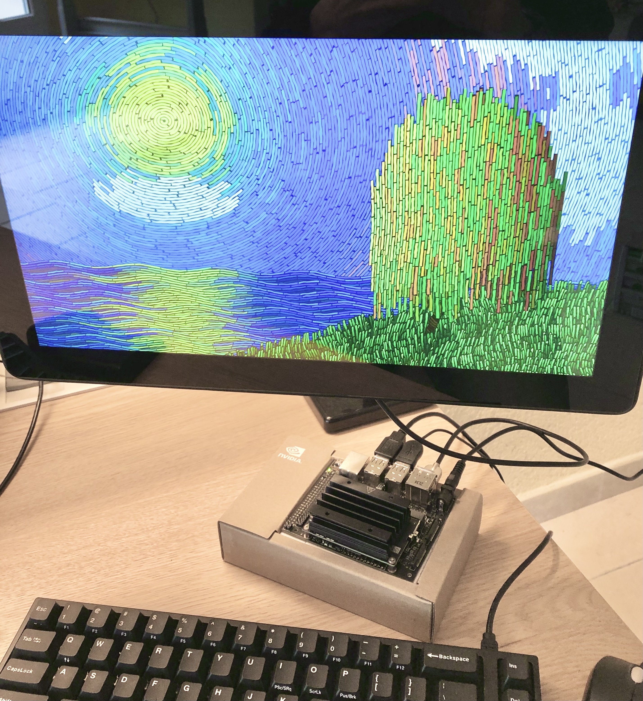

# KMS GLSL

KMS GLSL is a command line tool that runs OpenGL fragment shaders, using the [DRM/KMS Linux kernel subsystem](https://en.wikipedia.org/wiki/Direct_Rendering_Manager).
It runs shaders fullscreen, and does not require any windowing system, like X or Wayland.

It has initially been developed to run shaders from [Shadertoy](https://www.shadertoy.com), on the [Raspberry Pi](https://ttt.io/glsl-raspberry-pi), using the VC4/V3D KMS driver, that supports OpenGL ES 3.1 (as of January 2023).
However, it should work with any GPU and display controller hardware, provided a DRM/KMS driver is available.
It has been successfully tested with the [Jetson Nano](https://ttt.io/glsl-jetson-nano), as well as the Raspberry Pi Zero.

In the following picture, this [Shadertoy shader](https://www.shadertoy.com/view/MsX3Wj) runs on the Raspberry Pi 4, connected to the official Raspberry Pi 7" touchscreen monitor, in WVGA (800×480) resolution:


[Another shader](https://www.shadertoy.com/view/fstyD4) that runs on the Jetson Nano in full HD (1920×1080) resolution:



## Build

```shell
$ sudo apt update
# Install the build tools
$ sudo apt install gcc make
# Install the required DRM, GBM, EGL and OpenGL ES API headers
$ sudo apt install libdrm-dev libgbm-dev libegl-dev libgles2-mesa-dev
# Install the X C binding and RandR extension header / library files (optional)
$ sudo apt install libxcb-randr0-dev
# Build the glsl CLI binary
$ make
```

## Usage

```console
$ ./glsl -h
Usage: ./glsl [-aAcDfmpvx] <shader_file>

options:
    -a, --async              use async page flipping
    -A, --atomic             use atomic modesetting and fencing
    -c, --count              run for the specified number of frames
    -D, --device=DEVICE      use the given device
    -f, --format=FOURCC      framebuffer format
    -h, --help               print usage
    -m, --modifier=MODIFIER  hardcode the selected modifier
    -p, --perfcntr=LIST      sample specified performance counters using
                             the AMD_performance_monitor extension (comma
                             separated list)
    -v, --vmode=VMODE        specify the video mode in the format
                             <mode>[-<vrefresh>]
    -x, --surfaceless        use surfaceless mode, instead of GBM surface
```

You can try with the shaders copied from Shadertoy into the `examples` directory, e.g.:

```shell
$ ./glsl examples/stripey_torus_interior.glsl
```

Press <kbd>Ctrl</kbd>+<kbd>c</kbd> to exit the program.
You can explore [shadertoy.com](https://www.shadertoy.com) to find additional shaders.

> :warning: [Image shaders](https://www.shadertoy.com/howto#q1) from [Shadertoy](https://www.shadertoy.com/) are currently expected as input shader files.
>
> Note the shaders from the `examples` directory assume OpenGL ES 3.1 support, and may not work with lower versions of the specification.

## Raspberry Pi

Assuming you've installed [Raspberry Pi OS](https://www.raspberrypi.org/software/operating-systems), the DRM/KMS VC4/V3D driver can be configured by running the following commands:

1. Edit the [`/boot/config.txt`](https://www.raspberrypi.org/documentation/configuration/config-txt/) file, e.g.:

    ```shell
    $ sudo vi /boot/config.txt
    ```

2. Set the following properties:

    ```properties
    # Required: Enable the DRM/KMS VC4 V3D driver
    dtoverlay=vc4-kms-v3d
    # Optional: Increase the memory reserved for the GPU
    gpu_mem=128
    ```

3. Reboot your Raspberry Pi, so that the changes are taken into account, e.g.:

    ```shell
    $ sudo reboot
    ```

Note this also works with the Raspberry Pi OS Lite versions, as it does not need any compositor like X, Wayland or similar.

It has successfully been tested on the RPi 4, running the Raspberry Pi OS 2023-09-22, Linux kernel 5.15.

## Roadmap

- Feed the mouse uniform and keyboard texture
- Feed arbitrary variables / buffers from different languages / runtimes (Python, Node.js, ...)
- Feed audio / video inputs to microphone / camera textures
- Package Shadertoy default textures (image, font, noise, ...)
- Load arbitrary texture files

## Credits

The DRM/KMS ceremony code is copied from [kmscube](https://gitlab.freedesktop.org/mesa/kmscube/).

The shader examples are copied from the [Shadertoy](https://www.shadertoy.com) website URLs commented at the top of each file.
